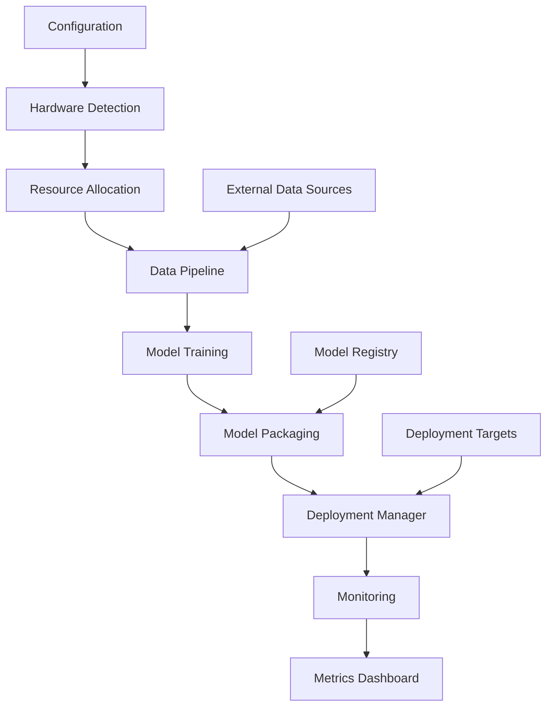

# Bangkong LLM Training System Architecture

## Overview

The Bangkong LLM Training System is a modular, environment-agnostic platform for training, packaging, and deploying large language models. The system is designed to adapt dynamically to different hardware configurations and deployment environments.

## System Architecture

## Core Components

### 1. Configuration Management
- Dynamic configuration loading with environment variable support
- YAML-based configuration files
- Configuration schema validation
- Environment-specific configurations

### 2. Hardware Detection & Resource Allocation
- Automatic hardware detection (CPU, GPU, TPU)
- Dynamic resource allocation based on available hardware
- Cross-platform compatibility
- Adaptive batching and optimization

### 3. Data Processing Pipeline
- Multi-format data loading (text, images, audio, video, documents)
- Dynamic data processors
- Preprocessing and tokenization
- Data validation and cleaning

### 4. Model Training Engine
- Hardware-adaptive training
- Mixed precision support
- Gradient accumulation
- Checkpointing and recovery

### 5. Model Packaging System
- Multi-format model conversion (PyTorch, ONNX, SafeTensors)
- Quantization support (INT8, INT4)
- Metadata management
- Environment-agnostic packaging

### 6. Deployment Manager
- Multiple deployment targets (local, cloud, hybrid)
- API server generation
- Containerization support
- Load balancing

### 7. Monitoring & Evaluation
- Real-time resource monitoring
- Performance tracking
- Metrics collection
- Evaluation framework

## Data Flow

1. **Configuration Loading**: System loads configuration from YAML files with environment variable overrides
2. **Hardware Detection**: System detects available hardware and allocates resources accordingly
3. **Data Ingestion**: Data is loaded from various sources using dynamic processors
4. **Preprocessing**: Data is cleaned, validated, and tokenized
5. **Training**: Model is trained with hardware-adaptive parameters
6. **Packaging**: Trained model is packaged in multiple formats with metadata
7. **Deployment**: Model is deployed to target environment
8. **Monitoring**: System performance is tracked and metrics are collected

## Design Principles

### Environment Agnostic
All system components are designed to work across different environments without code changes:
- Path management uses dynamic resolution
- Hardware detection adapts to available resources
- Configuration supports environment variables
- Cross-platform compatibility testing

### Modular Architecture
System is built with loosely coupled modules:
- Clear separation of concerns
- Dependency injection for loose coupling
- Plugin architecture for extensibility
- Well-defined interfaces between components

### Dynamic Resource Management
System automatically adapts to available resources:
- Batch size scaling based on memory
- Device placement optimization
- Mixed precision when available
- Worker process management

### Configurable Behavior
All system behavior is controlled through configuration:
- YAML configuration files
- Environment variable overrides
- Runtime configuration updates
- Feature flags for optional components

## Technology Stack

### Core
- Python 3.8+
- PyTorch for deep learning
- Hugging Face Transformers for model implementations
- Pydantic for configuration validation

### Data Processing
- Pandas for structured data
- Pillow/OpenCV for image processing
- Librosa for audio processing
- PyPDF2/PyMuPDF for PDF processing

### Deployment
- FastAPI for API development
- Docker for containerization
- Kubernetes for orchestration

### Monitoring
- Weights & Biases for experiment tracking
- Prometheus for metrics collection
- Grafana for visualization

## Scalability

### Horizontal Scaling
- Distributed training support
- Multi-GPU training
- Cloud deployment options
- Load balancing

### Vertical Scaling
- Memory-efficient processing
- Gradient accumulation
- Mixed precision training
- Dynamic batching

## Security

### Data Security
- Secure data handling
- Encryption at rest and in transit
- Access control
- Audit logging

### Model Security
- Model integrity verification
- Secure model loading
- Protection against adversarial attacks
- Regular security updates

## Performance Optimization

### Hardware Acceleration
- GPU acceleration
- TPU support
- Mixed precision training
- Optimized kernels

### Memory Management
- Efficient memory allocation
- Gradient checkpointing
- Model parallelization
- Memory pooling

### Computational Efficiency
- Just-in-time compilation
- Caching mechanisms
- Parallel processing
- Algorithmic optimizations